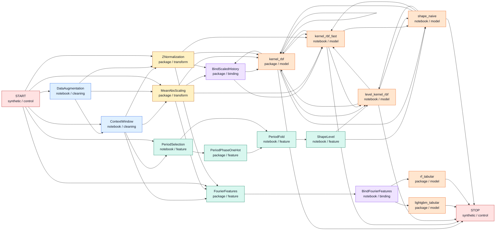

# Token Graph

Project: `graph_Time_series`

Generated from `token_catalog.json`.

## Core Graph

Core view hides generic binders, aliases, and broad experimental adapters.

## Full Graph

Full view includes adapter/factory tokens and aliases.

```mermaid
flowchart LR
  n_START["START<br/>synthetic / control"]:::control
  n_STOP["STOP<br/>synthetic / control"]:::control
  n_ContextWindow["ContextWindow<br/>notebook / cleaning"]:::cleaning
  n_DataAugmentation["DataAugmentation<br/>notebook / cleaning"]:::cleaning
  n_MeanAbsScaling["MeanAbsScaling<br/>package / transform"]:::transform
  n_ZNormalization["ZNormalization<br/>package / transform"]:::transform
  n_FourierFeatures["FourierFeatures<br/>package / feature"]:::feature
  n_PeriodFold["PeriodFold<br/>notebook / feature"]:::feature
  n_PeriodPhaseOneHot["PeriodPhaseOneHot<br/>package / feature"]:::feature
  n_PeriodSelection["PeriodSelection<br/>notebook / feature"]:::feature
  n_ShapeLevel["ShapeLevel<br/>notebook / feature"]:::feature
  n_BindAllSafeTabular["BindAllSafeTabular<br/>package / binding"]:::binding
  n_BindFeatureToken["BindFeatureToken<br/>package / binding"]:::binding
  n_BindFourierFeatures["BindFourierFeatures<br/>notebook / binding"]:::binding
  n_BindRawHistory["BindRawHistory<br/>notebook / binding"]:::binding
  n_BindScaledHistory["BindScaledHistory<br/>package / binding"]:::binding
  n_StackFeatureBundleToken["StackFeatureBundleToken<br/>package / binding"]:::binding
  n_StackFourierScaled["StackFourierScaled<br/>notebook / binding"]:::binding
  n_StackScaledContext["StackScaledContext<br/>notebook / binding"]:::binding
  n_kernel_rbf["kernel_rbf<br/>package / model"]:::model
  n_kernel_rbf_fast["kernel_rbf_fast<br/>notebook / model"]:::model
  n_kernel_rbf_loo["kernel_rbf_loo<br/>notebook / model"]:::model
  n_level_kernel_rbf["level_kernel_rbf<br/>notebook / model"]:::model
  n_lightgbm_tabular["lightgbm_tabular<br/>package / model"]:::model
  n_rf_tabular["rf_tabular<br/>package / model"]:::model
  n_shape_naive["shape_naive<br/>notebook / model"]:::model
  n_BindAllSafeTabular --> n_kernel_rbf
  n_BindAllSafeTabular --> n_kernel_rbf_fast
  n_BindAllSafeTabular --> n_kernel_rbf_loo
  n_BindAllSafeTabular --> n_lightgbm_tabular
  n_BindAllSafeTabular --> n_rf_tabular
  n_BindFourierFeatures --> n_lightgbm_tabular
  n_BindFourierFeatures --> n_rf_tabular
  n_BindRawHistory --> n_kernel_rbf
  n_BindRawHistory --> n_kernel_rbf_fast
  n_BindScaledHistory --> n_BindAllSafeTabular
  n_BindScaledHistory --> n_kernel_rbf
  n_BindScaledHistory --> n_kernel_rbf_fast
  n_BindScaledHistory --> n_kernel_rbf_loo
  n_ContextWindow --> n_BindRawHistory
  n_ContextWindow --> n_FourierFeatures
  n_ContextWindow --> n_MeanAbsScaling
  n_ContextWindow --> n_PeriodSelection
  n_ContextWindow --> n_ZNormalization
  n_DataAugmentation --> n_ContextWindow
  n_DataAugmentation --> n_MeanAbsScaling
  n_DataAugmentation --> n_ZNormalization
  n_FourierFeatures --> n_BindAllSafeTabular
  n_FourierFeatures --> n_BindFourierFeatures
  n_FourierFeatures --> n_StackFeatureBundleToken
  n_FourierFeatures --> n_StackFourierScaled
  n_MeanAbsScaling --> n_BindAllSafeTabular
  n_MeanAbsScaling --> n_BindScaledHistory
  n_MeanAbsScaling --> n_FourierFeatures
  n_MeanAbsScaling --> n_StackScaledContext
  n_MeanAbsScaling --> n_kernel_rbf
  n_MeanAbsScaling --> n_kernel_rbf_fast
  n_MeanAbsScaling --> n_kernel_rbf_loo
  n_PeriodFold --> n_BindAllSafeTabular
  n_PeriodFold --> n_ShapeLevel
  n_PeriodFold --> n_StackFeatureBundleToken
  n_PeriodPhaseOneHot --> n_BindAllSafeTabular
  n_PeriodPhaseOneHot --> n_PeriodFold
  n_PeriodPhaseOneHot --> n_StackFeatureBundleToken
  n_PeriodSelection --> n_PeriodFold
  n_PeriodSelection --> n_PeriodPhaseOneHot
  n_START --> n_BindRawHistory
  n_START --> n_ContextWindow
  n_START --> n_DataAugmentation
  n_START --> n_FourierFeatures
  n_START --> n_MeanAbsScaling
  n_START --> n_PeriodSelection
  n_START --> n_ZNormalization
  n_ShapeLevel --> n_BindAllSafeTabular
  n_ShapeLevel --> n_StackFeatureBundleToken
  n_ShapeLevel --> n_level_kernel_rbf
  n_ShapeLevel --> n_shape_naive
  n_StackFeatureBundleToken --> n_kernel_rbf
  n_StackFeatureBundleToken --> n_kernel_rbf_fast
  n_StackFeatureBundleToken --> n_kernel_rbf_loo
  n_StackFeatureBundleToken --> n_lightgbm_tabular
  n_StackFeatureBundleToken --> n_rf_tabular
  n_StackFourierScaled --> n_lightgbm_tabular
  n_StackFourierScaled --> n_rf_tabular
  n_StackScaledContext --> n_kernel_rbf
  n_StackScaledContext --> n_kernel_rbf_fast
  n_StackScaledContext --> n_kernel_rbf_loo
  n_ZNormalization --> n_BindAllSafeTabular
  n_ZNormalization --> n_BindScaledHistory
  n_ZNormalization --> n_FourierFeatures
  n_ZNormalization --> n_StackScaledContext
  n_ZNormalization --> n_kernel_rbf
  n_ZNormalization --> n_kernel_rbf_fast
  n_ZNormalization --> n_kernel_rbf_loo
  n_kernel_rbf --> n_BindAllSafeTabular
  n_kernel_rbf --> n_BindScaledHistory
  n_kernel_rbf --> n_STOP
  n_kernel_rbf --> n_kernel_rbf
  n_kernel_rbf --> n_kernel_rbf_fast
  n_kernel_rbf --> n_kernel_rbf_loo
  n_kernel_rbf --> n_level_kernel_rbf
  n_kernel_rbf --> n_shape_naive
  n_kernel_rbf_fast --> n_STOP
  n_kernel_rbf_fast --> n_kernel_rbf
  n_kernel_rbf_fast --> n_kernel_rbf_loo
  n_kernel_rbf_fast --> n_level_kernel_rbf
  n_kernel_rbf_fast --> n_shape_naive
  n_kernel_rbf_loo --> n_STOP
  n_kernel_rbf_loo --> n_kernel_rbf
  n_kernel_rbf_loo --> n_kernel_rbf_fast
  n_kernel_rbf_loo --> n_level_kernel_rbf
  n_kernel_rbf_loo --> n_shape_naive
  n_level_kernel_rbf --> n_STOP
  n_level_kernel_rbf --> n_kernel_rbf
  n_level_kernel_rbf --> n_kernel_rbf_fast
  n_level_kernel_rbf --> n_kernel_rbf_loo
  n_level_kernel_rbf --> n_shape_naive
  n_lightgbm_tabular --> n_STOP
  n_rf_tabular --> n_STOP
  n_shape_naive --> n_STOP
  n_shape_naive --> n_kernel_rbf
  n_shape_naive --> n_kernel_rbf_fast
  n_shape_naive --> n_kernel_rbf_loo
  n_shape_naive --> n_level_kernel_rbf
  classDef control fill:#ffe2e2,stroke:#b91c1c,stroke-width:1px,color:#111827
  classDef cleaning fill:#dff0ff,stroke:#2563eb,stroke-width:1px,color:#111827
  classDef transform fill:#fff1c2,stroke:#b45309,stroke-width:1px,color:#111827
  classDef feature fill:#d8f7ef,stroke:#047857,stroke-width:1px,color:#111827
  classDef binding fill:#efe3ff,stroke:#7c3aed,stroke-width:1px,color:#111827
  classDef model fill:#ffe6cf,stroke:#ea580c,stroke-width:1px,color:#111827
  classDef planned fill:#f4f4f5,stroke:#71717a,stroke-width:1px,color:#111827
  classDef terminal fill:#f0fdf4,stroke:#166534,stroke-width:1px,color:#111827
```

## Token Matrix

| Token | Status | Class | Core | Parents | Next |
| --- | --- | --- | --- | --- | --- |
| `START` | synthetic | control | yes |  | `BindRawHistory`, `ContextWindow`, `DataAugmentation`, `FourierFeatures`, `MeanAbsScaling`, `PeriodSelection`, `ZNormalization` |
| `STOP` | synthetic | control | yes | `kernel_rbf`, `kernel_rbf_fast`, `kernel_rbf_loo`, `level_kernel_rbf`, `lightgbm_tabular`, `rf_tabular`, `shape_naive` |  |
| `ContextWindow` | notebook | cleaning | yes | `DataAugmentation`, `START` | `BindRawHistory`, `FourierFeatures`, `MeanAbsScaling`, `PeriodSelection`, `ZNormalization` |
| `DataAugmentation` | notebook | cleaning | yes | `START` | `ContextWindow`, `MeanAbsScaling`, `ZNormalization` |
| `MeanAbsScaling` | package | transform | yes | `ContextWindow`, `DataAugmentation`, `START` | `BindAllSafeTabular`, `BindScaledHistory`, `FourierFeatures`, `StackScaledContext`, `kernel_rbf`, `kernel_rbf_fast`, `kernel_rbf_loo` |
| `ZNormalization` | package | transform | yes | `ContextWindow`, `DataAugmentation`, `START` | `BindAllSafeTabular`, `BindScaledHistory`, `FourierFeatures`, `StackScaledContext`, `kernel_rbf`, `kernel_rbf_fast`, `kernel_rbf_loo` |
| `FourierFeatures` | package | feature | yes | `ContextWindow`, `MeanAbsScaling`, `START`, `ZNormalization` | `BindAllSafeTabular`, `BindFourierFeatures`, `StackFeatureBundleToken`, `StackFourierScaled` |
| `PeriodFold` | notebook | feature | yes | `PeriodPhaseOneHot`, `PeriodSelection` | `BindAllSafeTabular`, `ShapeLevel`, `StackFeatureBundleToken` |
| `PeriodPhaseOneHot` | package | feature | yes | `PeriodSelection` | `BindAllSafeTabular`, `PeriodFold`, `StackFeatureBundleToken` |
| `PeriodSelection` | notebook | feature | yes | `ContextWindow`, `START` | `PeriodFold`, `PeriodPhaseOneHot` |
| `ShapeLevel` | notebook | feature | yes | `PeriodFold` | `BindAllSafeTabular`, `StackFeatureBundleToken`, `level_kernel_rbf`, `shape_naive` |
| `BindAllSafeTabular` | package | binding | no | `BindScaledHistory`, `FourierFeatures`, `MeanAbsScaling`, `PeriodFold`, `PeriodPhaseOneHot`, `ShapeLevel`, `ZNormalization`, `kernel_rbf` | `kernel_rbf`, `kernel_rbf_fast`, `kernel_rbf_loo`, `lightgbm_tabular`, `rf_tabular` |
| `BindFeatureToken` | package | binding | no |  |  |
| `BindFourierFeatures` | notebook | binding | yes | `FourierFeatures` | `lightgbm_tabular`, `rf_tabular` |
| `BindRawHistory` | notebook | binding | no | `ContextWindow`, `START` | `kernel_rbf`, `kernel_rbf_fast` |
| `BindScaledHistory` | package | binding | yes | `MeanAbsScaling`, `ZNormalization`, `kernel_rbf` | `BindAllSafeTabular`, `kernel_rbf`, `kernel_rbf_fast`, `kernel_rbf_loo` |
| `StackFeatureBundleToken` | package | binding | no | `FourierFeatures`, `PeriodFold`, `PeriodPhaseOneHot`, `ShapeLevel` | `kernel_rbf`, `kernel_rbf_fast`, `kernel_rbf_loo`, `lightgbm_tabular`, `rf_tabular` |
| `StackFourierScaled` | notebook | binding | no | `FourierFeatures` | `lightgbm_tabular`, `rf_tabular` |
| `StackScaledContext` | notebook | binding | no | `MeanAbsScaling`, `ZNormalization` | `kernel_rbf`, `kernel_rbf_fast`, `kernel_rbf_loo` |
| `kernel_rbf` | package | model | yes | `BindAllSafeTabular`, `BindRawHistory`, `BindScaledHistory`, `MeanAbsScaling`, `StackFeatureBundleToken`, `StackScaledContext`, `ZNormalization`, `kernel_rbf`, `kernel_rbf_fast`, `kernel_rbf_loo`, `level_kernel_rbf`, `shape_naive` | `BindAllSafeTabular`, `BindScaledHistory`, `STOP`, `kernel_rbf`, `kernel_rbf_fast`, `kernel_rbf_loo`, `level_kernel_rbf`, `shape_naive` |
| `kernel_rbf_fast` | notebook | model | yes | `BindAllSafeTabular`, `BindRawHistory`, `BindScaledHistory`, `MeanAbsScaling`, `StackFeatureBundleToken`, `StackScaledContext`, `ZNormalization`, `kernel_rbf`, `kernel_rbf_loo`, `level_kernel_rbf`, `shape_naive` | `STOP`, `kernel_rbf`, `kernel_rbf_loo`, `level_kernel_rbf`, `shape_naive` |
| `kernel_rbf_loo` | notebook | model | no | `BindAllSafeTabular`, `BindScaledHistory`, `MeanAbsScaling`, `StackFeatureBundleToken`, `StackScaledContext`, `ZNormalization`, `kernel_rbf`, `kernel_rbf_fast`, `level_kernel_rbf`, `shape_naive` | `STOP`, `kernel_rbf`, `kernel_rbf_fast`, `level_kernel_rbf`, `shape_naive` |
| `level_kernel_rbf` | notebook | model | yes | `ShapeLevel`, `kernel_rbf`, `kernel_rbf_fast`, `kernel_rbf_loo`, `shape_naive` | `STOP`, `kernel_rbf`, `kernel_rbf_fast`, `kernel_rbf_loo`, `shape_naive` |
| `lightgbm_tabular` | package | model | yes | `BindAllSafeTabular`, `BindFourierFeatures`, `StackFeatureBundleToken`, `StackFourierScaled` | `STOP` |
| `rf_tabular` | package | model | yes | `BindAllSafeTabular`, `BindFourierFeatures`, `StackFeatureBundleToken`, `StackFourierScaled` | `STOP` |
| `shape_naive` | notebook | model | yes | `ShapeLevel`, `kernel_rbf`, `kernel_rbf_fast`, `kernel_rbf_loo`, `level_kernel_rbf` | `STOP`, `kernel_rbf`, `kernel_rbf_fast`, `kernel_rbf_loo`, `level_kernel_rbf` |
