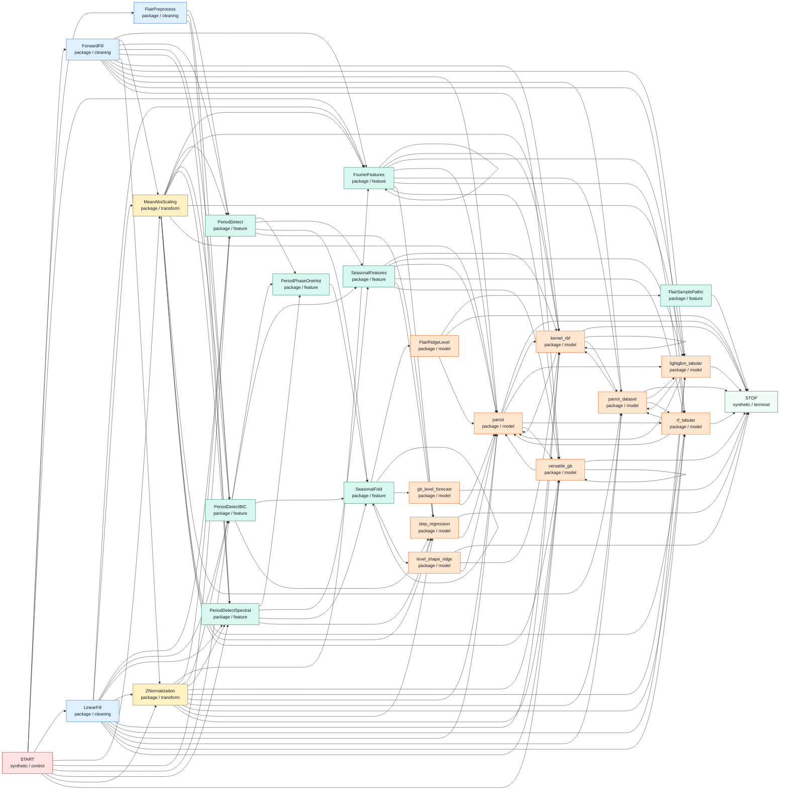

# Token Graph

Project: `graph_Time_series`

Generated from `token_catalog.json`.

## Core Graph

Core view hides generic binders, aliases, and broad experimental adapters.

## Full Graph

Full view includes adapter/factory tokens and aliases.

## Token Matrix

| Token | Status | Class | Core | Parents | Next |
| --- | --- | --- | --- | --- | --- |
| `START` | synthetic | control | yes |  | `FlairPreprocess`, `ForwardFill`, `FourierFeatures`, `LinearFill`, `MeanAbsScaling`, `PeriodDetect`, `PeriodDetectBIC`, `PeriodDetectSpectral`, `ZNormalization`, `versatile_gb` |
| `FlairPreprocess` | package | cleaning | yes | `START` | `PeriodDetect`, `PeriodDetectBIC`, `PeriodDetectSpectral` |
| `ForwardFill` | package | cleaning | yes | `START` | `FourierFeatures`, `MeanAbsScaling`, `PeriodDetect`, `PeriodDetectBIC`, `PeriodDetectSpectral`, `ZNormalization`, `kernel_rbf`, `lightgbm_tabular`, `parrot`, `parrot_dataset`, `rf_tabular`, `versatile_gb` |
| `LinearFill` | package | cleaning | yes | `START` | `FourierFeatures`, `MeanAbsScaling`, `PeriodDetect`, `PeriodDetectBIC`, `PeriodDetectSpectral`, `ZNormalization`, `kernel_rbf`, `lightgbm_tabular`, `parrot`, `parrot_dataset`, `rf_tabular`, `versatile_gb` |
| `MeanAbsScaling` | package | transform | yes | `ForwardFill`, `LinearFill`, `START` | `FourierFeatures`, `PeriodDetect`, `PeriodDetectBIC`, `PeriodDetectSpectral`, `kernel_rbf`, `lightgbm_tabular`, `parrot`, `parrot_dataset`, `rf_tabular`, `step_regression`, `versatile_gb` |
| `ZNormalization` | package | transform | yes | `ForwardFill`, `LinearFill`, `START` | `FourierFeatures`, `PeriodDetect`, `PeriodDetectBIC`, `PeriodDetectSpectral`, `kernel_rbf`, `lightgbm_tabular`, `parrot`, `parrot_dataset`, `rf_tabular`, `step_regression`, `versatile_gb` |
| `FlairSamplePaths` | package | feature | yes | `FlairRidgeLevel` | `STOP` |
| `FourierFeatures` | package | feature | yes | `ForwardFill`, `FourierFeatures`, `LinearFill`, `MeanAbsScaling`, `START`, `ZNormalization` | `FourierFeatures`, `kernel_rbf`, `lightgbm_tabular`, `parrot`, `parrot_dataset`, `rf_tabular`, `step_regression`, `versatile_gb` |
| `PeriodDetect` | package | feature | yes | `FlairPreprocess`, `ForwardFill`, `LinearFill`, `MeanAbsScaling`, `START`, `ZNormalization` | `PeriodPhaseOneHot`, `SeasonalFeatures`, `SeasonalFold`, `step_regression` |
| `PeriodDetectBIC` | package | feature | yes | `FlairPreprocess`, `ForwardFill`, `LinearFill`, `MeanAbsScaling`, `START`, `ZNormalization` | `PeriodPhaseOneHot`, `SeasonalFeatures`, `SeasonalFold`, `step_regression` |
| `PeriodDetectSpectral` | package | feature | yes | `FlairPreprocess`, `ForwardFill`, `LinearFill`, `MeanAbsScaling`, `START`, `ZNormalization` | `PeriodPhaseOneHot`, `SeasonalFeatures`, `SeasonalFold`, `step_regression` |
| `PeriodPhaseOneHot` | package | feature | yes | `PeriodDetect`, `PeriodDetectBIC`, `PeriodDetectSpectral` | `SeasonalFold` |
| `SeasonalFeatures` | package | feature | yes | `PeriodDetect`, `PeriodDetectBIC`, `PeriodDetectSpectral` | `kernel_rbf`, `lightgbm_tabular`, `parrot`, `rf_tabular`, `step_regression`, `versatile_gb` |
| `SeasonalFold` | package | feature | yes | `PeriodDetect`, `PeriodDetectBIC`, `PeriodDetectSpectral`, `PeriodPhaseOneHot`, `SeasonalFold` | `FlairRidgeLevel`, `SeasonalFold`, `gb_level_forecast`, `level_shape_ridge` |
| `FlairRidgeLevel` | package | model | yes | `SeasonalFold` | `FlairSamplePaths`, `STOP`, `parrot` |
| `gb_level_forecast` | package | model | yes | `SeasonalFold` | `STOP`, `parrot` |
| `kernel_rbf` | package | model | yes | `ForwardFill`, `FourierFeatures`, `LinearFill`, `MeanAbsScaling`, `SeasonalFeatures`, `ZNormalization`, `kernel_rbf`, `level_shape_ridge`, `parrot`, `parrot_dataset` | `STOP`, `kernel_rbf`, `parrot`, `parrot_dataset` |
| `level_shape_ridge` | package | model | yes | `SeasonalFold` | `STOP`, `kernel_rbf`, `parrot` |
| `lightgbm_tabular` | package | model | yes | `ForwardFill`, `FourierFeatures`, `LinearFill`, `MeanAbsScaling`, `SeasonalFeatures`, `ZNormalization`, `parrot`, `parrot_dataset` | `STOP`, `parrot`, `parrot_dataset` |
| `parrot` | package | model | yes | `FlairRidgeLevel`, `ForwardFill`, `FourierFeatures`, `LinearFill`, `MeanAbsScaling`, `SeasonalFeatures`, `ZNormalization`, `gb_level_forecast`, `kernel_rbf`, `level_shape_ridge`, `lightgbm_tabular`, `rf_tabular`, `step_regression`, `versatile_gb` | `STOP`, `kernel_rbf`, `lightgbm_tabular`, `rf_tabular`, `versatile_gb` |
| `parrot_dataset` | package | model | yes | `ForwardFill`, `FourierFeatures`, `LinearFill`, `MeanAbsScaling`, `ZNormalization`, `kernel_rbf`, `lightgbm_tabular`, `rf_tabular` | `STOP`, `kernel_rbf`, `lightgbm_tabular`, `rf_tabular` |
| `rf_tabular` | package | model | yes | `ForwardFill`, `FourierFeatures`, `LinearFill`, `MeanAbsScaling`, `SeasonalFeatures`, `ZNormalization`, `parrot`, `parrot_dataset` | `STOP`, `parrot`, `parrot_dataset` |
| `step_regression` | package | model | yes | `FourierFeatures`, `MeanAbsScaling`, `PeriodDetect`, `PeriodDetectBIC`, `PeriodDetectSpectral`, `SeasonalFeatures`, `ZNormalization` | `STOP`, `parrot` |
| `versatile_gb` | package | model | yes | `ForwardFill`, `FourierFeatures`, `LinearFill`, `MeanAbsScaling`, `START`, `SeasonalFeatures`, `ZNormalization`, `parrot`, `versatile_gb` | `STOP`, `parrot`, `versatile_gb` |
| `STOP` | synthetic | terminal | yes | `FlairRidgeLevel`, `FlairSamplePaths`, `gb_level_forecast`, `kernel_rbf`, `level_shape_ridge`, `lightgbm_tabular`, `parrot`, `parrot_dataset`, `rf_tabular`, `step_regression`, `versatile_gb` |  |
