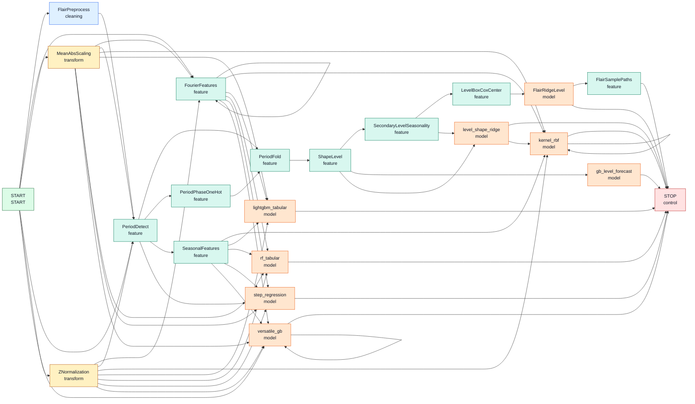

# Token Graph

Project: `graph_Time_series`

Generated from the live package registries, not the manual catalog JSON.

Registry stack:

```python
register_seasonal_tokens(
    register_flair_gb_swap(
        register_versatile_tokens(
            register_flair_tokens(
                register_default_tokens(Grammar())
            )
        )
    )
)
```

Current live grammar:

```text
Grammar(20 tokens, 57 edges)
```

## Graph



## Token Matrix

| Token | Class | Parents | Next |
| --- | --- | --- | --- |
| `START` | START |  | `FlairPreprocess`, `FourierFeatures`, `MeanAbsScaling`, `PeriodDetect`, `ZNormalization`, `versatile_gb` |
| `FlairPreprocess` | cleaning | `START` | `PeriodDetect` |
| `STOP` | control | `FlairRidgeLevel`, `FlairSamplePaths`, `gb_level_forecast`, `kernel_rbf`, `level_shape_ridge`, `lightgbm_tabular`, `rf_tabular`, `step_regression`, `versatile_gb` |  |
| `FlairSamplePaths` | feature | `FlairRidgeLevel` | `STOP` |
| `FourierFeatures` | feature | `FourierFeatures`, `MeanAbsScaling`, `START`, `ZNormalization` | `FourierFeatures`, `kernel_rbf`, `lightgbm_tabular`, `rf_tabular`, `step_regression`, `versatile_gb` |
| `LevelBoxCoxCenter` | feature | `SecondaryLevelSeasonality` | `FlairRidgeLevel` |
| `PeriodDetect` | feature | `FlairPreprocess`, `MeanAbsScaling`, `START`, `ZNormalization` | `PeriodFold`, `PeriodPhaseOneHot`, `SeasonalFeatures`, `step_regression` |
| `PeriodFold` | feature | `PeriodDetect`, `PeriodPhaseOneHot` | `ShapeLevel` |
| `PeriodPhaseOneHot` | feature | `PeriodDetect` | `PeriodFold` |
| `SeasonalFeatures` | feature | `PeriodDetect` | `kernel_rbf`, `lightgbm_tabular`, `rf_tabular`, `step_regression`, `versatile_gb` |
| `SecondaryLevelSeasonality` | feature | `ShapeLevel` | `LevelBoxCoxCenter`, `level_shape_ridge` |
| `ShapeLevel` | feature | `PeriodFold` | `SecondaryLevelSeasonality`, `gb_level_forecast`, `level_shape_ridge` |
| `FlairRidgeLevel` | model | `LevelBoxCoxCenter` | `FlairSamplePaths`, `STOP` |
| `gb_level_forecast` | model | `ShapeLevel` | `STOP` |
| `kernel_rbf` | model | `FourierFeatures`, `MeanAbsScaling`, `SeasonalFeatures`, `ZNormalization`, `kernel_rbf`, `level_shape_ridge` | `STOP`, `kernel_rbf` |
| `level_shape_ridge` | model | `SecondaryLevelSeasonality`, `ShapeLevel` | `STOP`, `kernel_rbf` |
| `lightgbm_tabular` | model | `FourierFeatures`, `MeanAbsScaling`, `SeasonalFeatures`, `ZNormalization` | `STOP` |
| `rf_tabular` | model | `FourierFeatures`, `MeanAbsScaling`, `SeasonalFeatures`, `ZNormalization` | `STOP` |
| `step_regression` | model | `FourierFeatures`, `MeanAbsScaling`, `PeriodDetect`, `SeasonalFeatures`, `ZNormalization` | `STOP` |
| `versatile_gb` | model | `FourierFeatures`, `MeanAbsScaling`, `START`, `SeasonalFeatures`, `ZNormalization`, `versatile_gb` | `STOP`, `versatile_gb` |
| `MeanAbsScaling` | transform | `START` | `FourierFeatures`, `PeriodDetect`, `kernel_rbf`, `lightgbm_tabular`, `rf_tabular`, `step_regression`, `versatile_gb` |
| `ZNormalization` | transform | `START` | `FourierFeatures`, `PeriodDetect`, `kernel_rbf`, `lightgbm_tabular`, `rf_tabular`, `step_regression`, `versatile_gb` |
