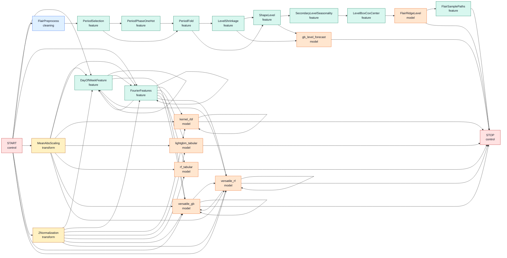

# Token Graph

Project: `graph_Time_series`

This Markdown view is aligned with the live package registries as of the
signal-board, binder-free architecture. It reflects:

```python
register_flair_gb_swap(
    register_versatile_tokens(
        register_flair_tokens(
            register_default_tokens(Grammar())
        )
    )
)
```

Current live grammar:

```text
Grammar(20 tokens, 58 edges)
```

Note: graph edges are syntactic possibilities. `Token.can_apply(state)` still
enforces usage caps, dependency checks, semantic ports, and model-specific
conditions. For example, `FourierFeatures` has a self-edge in the grammar, but
its `max_uses=1` prevents repeated application in a real state.

## Core Graph



## Token Matrix

| Token | Class | Parents | Next |
| --- | --- | --- | --- |
| `START` | control |  | `DayOfWeekFeature`, `FlairPreprocess`, `FourierFeatures`, `MeanAbsScaling`, `ZNormalization`, `versatile_gb`, `versatile_rf` |
| `STOP` | control | `FlairRidgeLevel`, `FlairSamplePaths`, `gb_level_forecast`, `kernel_rbf`, `lightgbm_tabular`, `rf_tabular`, `versatile_gb`, `versatile_rf` |  |
| `DayOfWeekFeature` | feature | `DayOfWeekFeature`, `FourierFeatures`, `MeanAbsScaling`, `START`, `ZNormalization` | `DayOfWeekFeature`, `FourierFeatures`, `versatile_gb`, `versatile_rf` |
| `FlairPreprocess` | cleaning | `START` | `PeriodSelection` |
| `FlairRidgeLevel` | model | `LevelBoxCoxCenter` | `FlairSamplePaths`, `STOP` |
| `FlairSamplePaths` | feature | `FlairRidgeLevel` | `STOP` |
| `FourierFeatures` | feature | `DayOfWeekFeature`, `FourierFeatures`, `MeanAbsScaling`, `START`, `ZNormalization` | `DayOfWeekFeature`, `FourierFeatures`, `kernel_rbf`, `lightgbm_tabular`, `rf_tabular`, `versatile_gb`, `versatile_rf` |
| `LevelBoxCoxCenter` | feature | `SecondaryLevelSeasonality` | `FlairRidgeLevel` |
| `LevelShrinkage` | feature | `PeriodFold` | `ShapeLevel`, `gb_level_forecast` |
| `MeanAbsScaling` | transform | `START` | `DayOfWeekFeature`, `FourierFeatures`, `kernel_rbf`, `lightgbm_tabular`, `rf_tabular`, `versatile_gb`, `versatile_rf` |
| `PeriodFold` | feature | `PeriodPhaseOneHot`, `PeriodSelection` | `LevelShrinkage`, `ShapeLevel` |
| `PeriodPhaseOneHot` | feature | `PeriodSelection` | `PeriodFold` |
| `PeriodSelection` | feature | `FlairPreprocess` | `PeriodFold`, `PeriodPhaseOneHot` |
| `SecondaryLevelSeasonality` | feature | `ShapeLevel` | `LevelBoxCoxCenter` |
| `ShapeLevel` | feature | `LevelShrinkage`, `PeriodFold` | `SecondaryLevelSeasonality`, `gb_level_forecast` |
| `ZNormalization` | transform | `START` | `DayOfWeekFeature`, `FourierFeatures`, `kernel_rbf`, `lightgbm_tabular`, `rf_tabular`, `versatile_gb`, `versatile_rf` |
| `gb_level_forecast` | model | `LevelShrinkage`, `ShapeLevel` | `STOP` |
| `kernel_rbf` | model | `FourierFeatures`, `MeanAbsScaling`, `ZNormalization`, `kernel_rbf` | `STOP`, `kernel_rbf` |
| `lightgbm_tabular` | model | `FourierFeatures`, `MeanAbsScaling`, `ZNormalization` | `STOP` |
| `rf_tabular` | model | `FourierFeatures`, `MeanAbsScaling`, `ZNormalization` | `STOP` |
| `versatile_gb` | model | `DayOfWeekFeature`, `FourierFeatures`, `MeanAbsScaling`, `START`, `ZNormalization`, `versatile_gb`, `versatile_rf` | `STOP`, `versatile_gb`, `versatile_rf` |
| `versatile_rf` | model | `DayOfWeekFeature`, `FourierFeatures`, `MeanAbsScaling`, `START`, `ZNormalization`, `versatile_gb`, `versatile_rf` | `STOP`, `versatile_gb`, `versatile_rf` |

## Legacy Catalog Warning

This file is currently the Markdown view aligned with the live package grammar.
The adjacent `token_catalog.json` may still contain older manual entries until
the catalog is refreshed.
